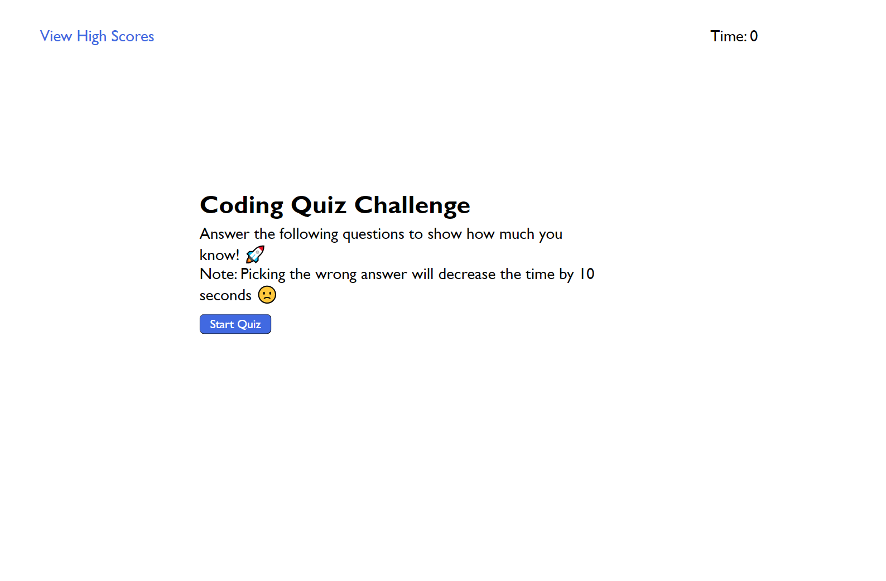

# JavaScript Quiz

# Description
- The motivation behind this project, was to help new developers prepare for a job interview
- I built this project to help new developers prepare for their first job interview
- This project will let developers know if they need more practice with JavaScript
- Building this project helped me with my problem solving skills. As well as how to use functions in a more productive way. 

# Usage

- When user click on the start button, the quiz wil start
- When the time ends, the user's score will be displayed
- User may then enter his initials and save his score
- User will be able to view all top scores at the end or if he clicks on "View High Scores"
- User has the ability to delete all high scores when he clicks on "Clear High Scores"

Link to deployed website[https://0mar77.github.io/wet-bottle/]

